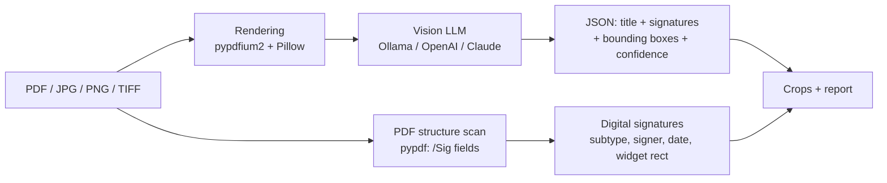

# Signum — AI document signature detection

[](https://www.python.org/)
[](https://doc.qt.io/qtforpython-6/)
[](https://mypy-lang.org/)
[](https://docs.astral.sh/ruff/)
[](LICENSE)

A Windows desktop application that scans PDFs and document images and answers one question:
**is this document signed?**

Drop in up to a thousand scans and PDFs, click *Przetwórz* (Process), and Signum:

- gives every file a short **AI-generated title** (e.g. `Skan_01.jpeg` → *"Formularz świadomej zgody"*),
- detects **handwritten signatures, initials (parafki), stamps** — visually, with a vision LLM,
- detects **all common digital signature types** — deterministically, from PDF structure
  (PAdES/CAdES, CMS/PKCS#7, X.509, RFC 3161 timestamps, certification signatures/DocMDP,
  usage-rights signatures),
- reports a **confidence score** for every detection,
- shows a **cropped image of each signature** so a human can verify at a glance,
- exports a self-contained **HTML report** (crops embedded, plus a page thumbnail
  with the detection box marked for every finding) and **CSV**.

> Signum detects the **presence** of signatures. It does not verify their cryptographic
> validity or legal force.


## How it works



Two independent detection paths are combined per document:

1. **Visual path** — every page is rendered to an image and sent to a vision model with a
   structured-output JSON schema. The model returns a short document description and a list
   of visible signatures (`handwritten` / `initials` / `stamp`) with normalized bounding
   boxes (`[ymin, xmin, ymax, xmax]`, 0–1000 scale) and confidence 0–100. Boxes are
   validated, padded and cropped from the full-resolution render.
2. **Structural path (PDF only)** — signature form fields are read directly from the PDF.
   A filled `/Sig` field *is* a digital signature (confidence 100), classified by
   `/SubFilter`; the visible signature widget is cropped from the rendered page.

Files are processed **sequentially** with a progress bar and ETA — memory usage stays flat
even for 1000-file batches. A per-file error never stops the batch; a lost AI connection
aborts it with a clear message.

## AI providers

| Provider | Configuration | Notes |
|---|---|---|
| **Ollama** (default) | URL + model picked from the installed list | 100% local, documents never leave your machine. Tested with `gemma4:12b`. |
| **OpenAI-compatible API** | base URL + API key + model | Works with OpenAI, OpenRouter and any `/chat/completions`-compatible endpoint. |
| **Claude (Anthropic)** | API key + model | Messages API with base64 image blocks. |

API keys are stored in the **Windows Credential Manager** (via `keyring`) — never in
config files. Settings live in `%APPDATA%\Signum\settings.json`.

The vision model must support images. On this project's reference setup —
[Gemma 4 12B](https://blog.google/innovation-and-ai/technology/developers-tools/introducing-gemma-4-12b/)
via Ollama — a page takes ~8–30 s and bounding boxes land with IoU 0.6–0.9.
Note: Ollama currently hard-codes Gemma 4's visual token budget to 280
(≈0.65 Mpx per page — an A4 page is seen at ~672×912 px), so image sizes above
1120 px mainly benefit cloud models. Because model-reported boxes are
approximate by nature, the HTML report pairs every crop with a page thumbnail
showing where the model pointed.

Switching from Ollama to a cloud provider triggers a warning dialog (documents
will leave your machine) with a 3-second hold on the confirm button, and a red
**"Model online"** badge stays visible in the status bar while a cloud provider
is active.

## Installation

### Installer (recommended)

Download `Signum-Setup-<version>.exe` from Releases and run it. Per-user install,
no administrator rights required. Polish and English installer languages.

### From source

```powershell
git clone <repository-url>
cd signum
python -m venv .venv
.venv\Scripts\pip install -e .[dev]
.venv\Scripts\signum          # GUI
```

For local AI: install [Ollama](https://ollama.com) and pull a vision model:

```powershell
ollama pull gemma4:12b
```

## Usage

**GUI:** start Signum → (first run) *Ustawienia AI* → choose provider and model →
drag & drop files/folders or use *Dodaj pliki…* / *Pracuj na folderze…* → *Przetwórz* →
review results and signature crops → *Zapisz raport…* (HTML/CSV).

**CLI** (automation / batch jobs):

```powershell
signum-cli C:\skany --html raport.html --csv raport.csv
signum-cli umowa.pdf skan.jpg --provider ollama --model gemma4:12b --max-pages 5
```


## Configuration

| Setting | Default | Meaning |
|---|---|---|
| `provider` | `ollama` | `ollama` / `openai` / `anthropic` |
| `ollama_url` | `http://localhost:11434` | Ollama endpoint |
| `ollama_model` | `gemma4:12b` | must be a vision model |
| `ollama_num_ctx` | `8192` | context window sent as `options.num_ctx` (Ollama's own default is only 4096) |
| `max_pages_per_doc` | `10` | pages analyzed per document |
| `model_image_max_side` | `1120` px | page image size sent to the model |
| `custom_prompt` | `""` | user-edited task part of the prompt; empty = built-in (the JSON response format is always appended automatically) |
| `timeout_s` | `300` | per-request AI timeout |
| `recursive_folders` | `true` | recurse into subfolders |

## Development

```powershell
.venv\Scripts\pip install -e .[dev]
.venv\Scripts\python -m pytest            # 92 tests, no network needed
.venv\Scripts\python -m ruff check src tests scripts
.venv\Scripts\python -m mypy
.venv\Scripts\python scripts\generate_fixtures.py   # example documents in examples/
```

Test documents (including **genuinely digitally-signed PDFs** — pyhanko with a self-signed
certificate) are generated on the fly by `tests/docfactory.py`; no binary fixtures in the repo.

### Building the installer

Requires [Inno Setup 6](https://jrsoftware.org/isinfo.php).

```powershell
powershell -ExecutionPolicy Bypass -File scripts\build_installer.ps1
# → installer\output\Signum-Setup-<version>.exe
```

### Project structure

```
src/signum/
├── app.py            # GUI entry point
├── cli.py            # headless batch mode (signum-cli)
├── config.py         # settings JSON + API keys in Credential Manager
├── ai/               # vision model clients (Ollama, OpenAI-compat, Anthropic),
│                     # shared prompt, JSON-schema, robust response parser
├── core/             # domain models, file discovery, PDF/image rendering,
│                     # digital signature scan, bbox cropping, batch pipeline
├── report/           # self-contained HTML + CSV export
└── ui/               # PySide6 main window, settings dialog, worker threads
```

Design notes live in [docs/ARCHITECTURE.md](docs/ARCHITECTURE.md);
a Polish user guide in [docs/INSTRUKCJA.pl.md](docs/INSTRUKCJA.pl.md).

## Privacy & limitations

- With Ollama, documents are processed entirely locally.
- With cloud providers, page images are sent to the provider's API — check your
  organization's policy before use. Signum makes this explicit: a countdown
  warning when switching away from the local provider and a persistent
  "Model online" badge in the status bar.
- Visual detection is probabilistic: confidence scores and crops exist precisely so that
  a human can verify. Digital-signature detection is structural and exact, but Signum
  **does not** validate certificates, revocation or document integrity.
- Encrypted PDFs that require a password are reported as errors (structure scan is skipped).

## License

[MIT](LICENSE)
