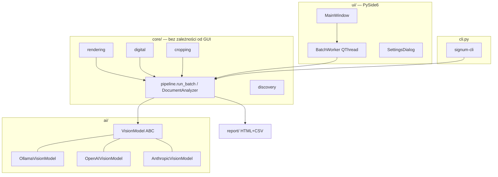

# Signum — architecture notes

## Goals & constraints

- **One question, answered reliably:** *is this document signed?* — with human-verifiable
  evidence (crops + confidence), not a black-box verdict.
- **Batch-scale:** up to ~1000 files in one run → sequential processing, flat memory
  profile, per-file fault isolation, progress + ETA + cancellation.
- **Model-agnostic:** local Ollama by default; any OpenAI-compatible or Anthropic API
  as a drop-in via one abstract interface.
- **Portfolio-grade hygiene:** typed (mypy), linted (ruff), tested (pytest + pytest-qt),
  permissive licenses only (hence `pypdfium2` instead of AGPL PyMuPDF).

## Layering

Zasada: **`core/` i `ai/` nie importują niczego z Qt** — GUI i CLI to cienkie
nakładki na ten sam pipeline. Postęp i anulowanie przechodzą przez callbacki
i `CancelToken` (thread-safe `threading.Event`).

## Detection model

Dwie niezależne ścieżki, łączone per dokument:

| Ścieżka | Co wykrywa | Jak | Pewność |
|---|---|---|---|
| wizyjna | podpis odręczny, parafka, pieczątka | render strony → vision LLM → JSON (schemat egzekwowany promptem + odpornym parserem; structured outputs tylko w ponowieniu) | deklarowana przez model 0–100 |
| strukturalna (PDF) | podpisy cyfrowe: PAdES/CAdES, PKCS#7 (adbe), X.509, znaczniki czasu RFC 3161, podpisy certyfikujące DocMDP, UR3 | pypdf: pola `/FT /Sig` z `/V`, klasyfikacja po `/SubFilter` | 100 (fakt strukturalny) |

Kluczowe decyzje:

- **Podpisy cyfrowe NIE są wykrywane przez LLM.** Obecność wypełnionego pola `/Sig`
  to fakt; pytanie modelu wizyjnego o nie byłoby mniej wiarygodne. Widget podpisu
  (jeśli widoczny, `/Rect` o niezerowej powierzchni) jest wycinany z renderu strony
  po przeliczeniu współrzędnych PDF (origin lewy-dolny, punkty) na piksele.
- **Puste pola podpisu** są raportowane osobno i nie liczą się jako podpis.
- **bounding boxy:** konwencja `[ymin, xmin, ymax, xmax]` w skali 0–1000
  (zbadana empirycznie na gemma4:12b — IoU 0.6–0.9). Ramki są walidowane
  (uporządkowanie, zakres, powierzchnia 0–65% strony) i wycinane z paddingiem 15%;
  ramka niewiarygodna → brak wycinka zamiast błędnego wycinka. Niezależnie od
  wycinka generowana jest **miniatura całej strony z narysowaną ramką** —
  także dla ramek odrzuconych, bo błędne wskazanie to informacja dla człowieka.
  Sufit jakości lokalizacji leży po stronie Ollamy: budżet tokenów wizyjnych
  gemma4 jest tam zaszyty na 280 (~0,65 Mpx na stronę), choć model wspiera do 1120.
- **Prompt:** podzielony na część merytoryczną (edytowalną przez użytkownika
  w ustawieniach, `PROMPT_INSTRUCTIONS`) i stały `PROMPT_FORMAT` z wymaganym
  schematem JSON, doklejany zawsze — parser i structured outputs zależą od
  schematu, więc nie wolno go oddać w ręce użytkownika.
- **Structured outputs tylko jako siatka bezpieczeństwa (od 1.0.2):** wymuszanie
  schematu gramatyką (`format` w Ollamie) obniża recall — model potrafi
  przedwcześnie zamknąć listę podpisów i zgubić podpis odręczny sąsiadujący
  z pieczątką (zbadane na gemma4:12b, deterministyczne przy temp 0; kompresja
  obrazu wykluczona jako przyczyna). Pierwsze zapytanie idzie więc bez `format`;
  ponowienie z `format` następuje tylko wtedy, gdy odpowiedź nie zawiera
  poprawnego obiektu JSON.
- **Parser odpowiedzi:** model potrafi otoczyć JSON płotkami markdown albo
  dokleić śmieci po obiekcie (zaobserwowane: `<|tool_response>`) — parser
  wycina pierwszy zbalansowany obiekt JSON z uwzględnieniem stringów i escape'ów.
  Błędne pojedyncze wpisy podpisów są pomijane, nie unieważniają strony.

## Error policy

| Zdarzenie | Reakcja |
|---|---|
| uszkodzony/nieczytelny plik | wynik `ERROR`, partia idzie dalej |
| zła odpowiedź modelu (`AIResponseError`) | 1 ponowienie strony; potem `ERROR` pliku |
| brak połączenia (`AIConnectionError`) | przerwanie partii (`abort_error`) — kolejne pliki i tak by poległy; nieprzetworzone dostają `CANCELLED` |
| anulowanie przez użytkownika | sprawdzane między stronami; nieprzetworzone pliki → `CANCELLED` |
| wyjątek w wątku roboczym | łapany defensywnie, zamieniany na `abort_error` |

## Threading (GUI)

Jeden `BatchWorker(QThread)` wykonuje `run_batch` i emituje sygnały
(`file_started`, `file_done`, `batch_done`); obiekty `DocumentResult` przechodzą
przez granicę wątków jako payload sygnałów (Qt queued connections), pixmapy
powstają dopiero w wątku GUI. Test połączenia, preflight przed partią i lista
modeli w ustawieniach też mają własne krótkie wątki — GUI nie blokuje na
operacjach sieciowych.

## Configuration & secrets

- `%APPDATA%\Signum\settings.json` — ustawienia jawne; nieznane klucze ignorowane
  (kompatybilność w przód), uszkodzony plik → domyślne.
- Klucze API — wyłącznie Windows Credential Manager (`keyring`, service `Signum`).
  Test w suite pilnuje, że do JSON-a nie trafia nic z `key` w nazwie.
- HTTP bez TLS jest dozwolone wyłącznie dla pętli zwrotnej. Zdalne endpointy
  wymagają HTTPS i nie mogą używać przekierowań; lokalne połączenia nie
  dziedziczą proxy z otoczenia procesu.

## Test strategy

- Fixtures generowane w locie (`tests/docfactory.py`) — zero binariów w repo;
  w tym **naprawdę podpisane PDF-y** (pyhanko + samopodpisany cert, PAdES i PKCS#7),
  puste pola podpisu, wielostronicowe TIFF-y, syntetyczne skany z „odręcznym"
  podpisem i pieczątką.
- Pipeline testowany z `FakeVisionModel` (bez sieci); GUI przez pytest-qt na
  platformie `offscreen`; parser na odpowiedziach zaobserwowanych u prawdziwego
  modelu.
- Test E2E z żywą Ollamą (gemma4:12b) wykonywany ręcznie / via `signum-cli`
  na `examples/` — nie jest częścią suite (wymaga GPU i modelu).

## Packaging

PyInstaller (onedir, bez konsoli, wycięte nieużywane moduły Qt) → test spakowanego
runtime'u → Inno Setup 6 (per-user, PL/EN, stały AppId dla aktualizacji).
Instalator zawiera Pythona i biblioteki, wykrywa opcjonalną Ollamę w standardowych
lokalizacjach, a aplikacja sprawdza usługę i model przed każdą partią. Wersja płynie z jednego źródła:
`signum.__version__` → hatchling (`pyproject`) → `build_installer.ps1` → ISCC.
